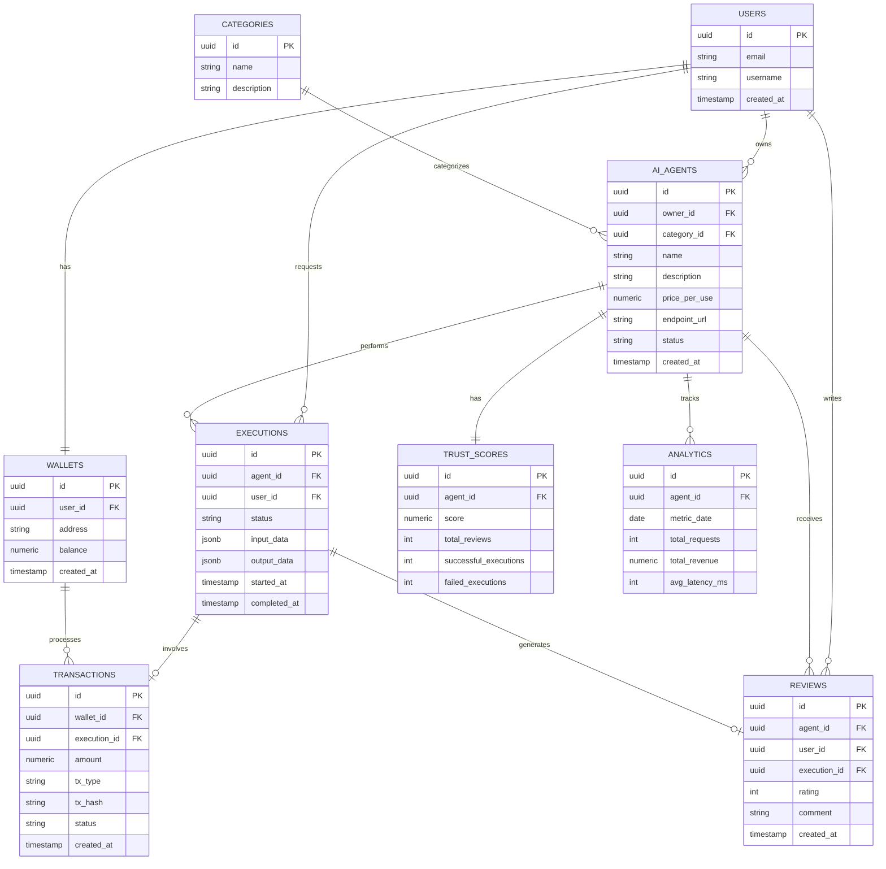

# AgoraMesh Database Design

## 1. Entity Relationship Diagram

## 2. Table Names & 3. Columns & 4. Data Types

### `users`
- `id` (UUID)
- `email` (VARCHAR(255))
- `username` (VARCHAR(100))
- `created_at` (TIMESTAMPTZ)
- `updated_at` (TIMESTAMPTZ)

### `categories`
- `id` (UUID)
- `name` (VARCHAR(100))
- `description` (TEXT)

### `ai_agents`
- `id` (UUID)
- `owner_id` (UUID)
- `category_id` (UUID)
- `name` (VARCHAR(100))
- `description` (TEXT)
- `price_per_use` (NUMERIC(18, 6))
- `endpoint_url` (VARCHAR(255))
- `status` (VARCHAR(50))
- `created_at` (TIMESTAMPTZ)
- `updated_at` (TIMESTAMPTZ)

### `wallets`
- `id` (UUID)
- `user_id` (UUID)
- `address` (VARCHAR(255))
- `balance` (NUMERIC(18, 6))
- `created_at` (TIMESTAMPTZ)
- `updated_at` (TIMESTAMPTZ)

### `trust_scores`
- `id` (UUID)
- `agent_id` (UUID)
- `score` (NUMERIC(5, 2))
- `total_reviews` (INTEGER)
- `successful_executions` (INTEGER)
- `failed_executions` (INTEGER)
- `updated_at` (TIMESTAMPTZ)

### `executions`
- `id` (UUID)
- `agent_id` (UUID)
- `user_id` (UUID)
- `status` (VARCHAR(50))
- `input_data` (JSONB)
- `output_data` (JSONB)
- `started_at` (TIMESTAMPTZ)
- `completed_at` (TIMESTAMPTZ)

### `transactions`
- `id` (UUID)
- `wallet_id` (UUID)
- `execution_id` (UUID, Nullable)
- `amount` (NUMERIC(18, 6))
- `tx_type` (VARCHAR(50))
- `tx_hash` (VARCHAR(255), Nullable)
- `status` (VARCHAR(50))
- `created_at` (TIMESTAMPTZ)

### `reviews`
- `id` (UUID)
- `agent_id` (UUID)
- `user_id` (UUID)
- `execution_id` (UUID)
- `rating` (SMALLINT)
- `comment` (TEXT, Nullable)
- `created_at` (TIMESTAMPTZ)

### `analytics`
- `id` (UUID)
- `agent_id` (UUID)
- `metric_date` (DATE)
- `total_requests` (INTEGER)
- `total_revenue` (NUMERIC(18, 6))
- `avg_latency_ms` (INTEGER)
- `updated_at` (TIMESTAMPTZ)

---

## 5. Primary Keys & 6. Foreign Keys

| Table | Primary Key | Foreign Keys |
|---|---|---|
| `users` | `id` | None |
| `categories` | `id` | None |
| `ai_agents` | `id` | `owner_id` -> `users(id)`, `category_id` -> `categories(id)` |
| `wallets` | `id` | `user_id` -> `users(id)` |
| `trust_scores` | `id` | `agent_id` -> `ai_agents(id)` |
| `executions` | `id` | `agent_id` -> `ai_agents(id)`, `user_id` -> `users(id)` |
| `transactions` | `id` | `wallet_id` -> `wallets(id)`, `execution_id` -> `executions(id)` |
| `reviews` | `id` | `agent_id` -> `ai_agents(id)`, `user_id` -> `users(id)`, `execution_id` -> `executions(id)` |
| `analytics` | `id` | `agent_id` -> `ai_agents(id)` |

---

## 7. Indexes & 8. Constraints

### Indexes
- `users`: `idx_users_email`, `idx_users_username`
- `ai_agents`: `idx_agents_owner`, `idx_agents_category`, `idx_agents_status`
- `wallets`: `idx_wallets_user`, `idx_wallets_address`
- `executions`: `idx_executions_agent`, `idx_executions_user`, `idx_executions_status`
- `transactions`: `idx_transactions_wallet`, `idx_transactions_tx_hash`
- `reviews`: `idx_reviews_agent`
- `analytics`: `idx_analytics_agent_date`

### Constraints
- **Unique**:
  - `users`: `email` (UNIQUE), `username` (UNIQUE)
  - `wallets`: `user_id` (UNIQUE), `address` (UNIQUE)
  - `trust_scores`: `agent_id` (UNIQUE)
  - `reviews`: `execution_id` (UNIQUE - one review per execution)
  - `analytics`: `(agent_id, metric_date)` (UNIQUE composite)
- **Check**:
  - `ai_agents`: `price_per_use >= 0`
  - `ai_agents`: `status IN ('active', 'inactive', 'suspended')`
  - `trust_scores`: `score >= 0.0 AND score <= 100.0`
  - `executions`: `status IN ('pending', 'running', 'completed', 'failed')`
  - `transactions`: `tx_type IN ('deposit', 'withdrawal', 'payment', 'refund')`
  - `transactions`: `status IN ('pending', 'completed', 'failed')`
  - `reviews`: `rating >= 1 AND rating <= 5`
- **Default**:
  - Timestamps: `DEFAULT now()`
  - UUIDs: `DEFAULT uuid_generate_v4()` (or Supabase equivalent)

---

## 9. Relationships

- **1:1** - `users` to `wallets` (Each user has exactly one wallet for marketplace transactions).
- **1:1** - `ai_agents` to `trust_scores` (One trust score record aggregating all stats per agent).
- **1:1** - `executions` to `reviews` (An execution can have at most one review from the buyer).
- **1:M** - `users` to `ai_agents` (A developer user can own multiple AI agents).
- **1:M** - `categories` to `ai_agents` (A category can contain multiple agents).
- **1:M** - `users` to `executions` (A user can request multiple agent executions).
- **1:M** - `ai_agents` to `executions` (An agent can perform multiple executions).
- **1:M** - `wallets` to `transactions` (A wallet can have multiple incoming/outgoing transactions).
- **1:M** - `ai_agents` to `analytics` (An agent has one analytics record per day).
- **0:1 to 1:M** - `executions` to `transactions` (An execution might trigger a payment transaction, or a refund).

---

## 10. Example Records

### `users`
| id | email | username | created_at |
|---|---|---|---|
| `u1...` | alice@example.com | alice_dev | 2026-07-31 10:00:00 |
| `u2...` | bob@example.com | bob_user | 2026-07-31 10:05:00 |

### `categories`
| id | name | description |
|---|---|---|
| `c1...` | DeFi | Decentralized Finance Agents |
| `c2...` | Data Analysis | Agents that analyze blockchain data |

### `ai_agents`
| id | owner_id | category_id | name | price_per_use | status |
|---|---|---|---|---|---|
| `a1...` | `u1...` | `c1...` | YieldOptimizer | 0.500000 | active |

### `wallets`
| id | user_id | address | balance |
|---|---|---|---|
| `w1...` | `u1...` | ALGOADDRESS1... | 150.500000 |
| `w2...` | `u2...` | ALGOADDRESS2... | 50.000000 |

### `trust_scores`
| id | agent_id | score | total_reviews | successful_executions | failed_executions |
|---|---|---|---|---|---|
| `ts1...` | `a1...` | 98.5 | 120 | 500 | 2 |

### `executions`
| id | agent_id | user_id | status | input_data | output_data |
|---|---|---|---|---|---|
| `ex1...` | `a1...` | `u2...` | completed | `{"param": "value"}` | `{"result": "success"}` |

### `transactions`
| id | wallet_id | execution_id | amount | tx_type | tx_hash | status |
|---|---|---|---|---|---|---|
| `tx1...` | `w2...` | `ex1...` | -0.500000 | payment | HASHXYZ... | completed |

### `reviews`
| id | agent_id | user_id | execution_id | rating | comment |
|---|---|---|---|---|---|
| `r1...` | `a1...` | `u2...` | `ex1...` | 5 | "Fast and accurate!" |

### `analytics`
| id | agent_id | metric_date | total_requests | total_revenue | avg_latency_ms |
|---|---|---|---|---|---|
| `an1...` | `a1...` | 2026-07-31 | 50 | 25.000000 | 1200 |
